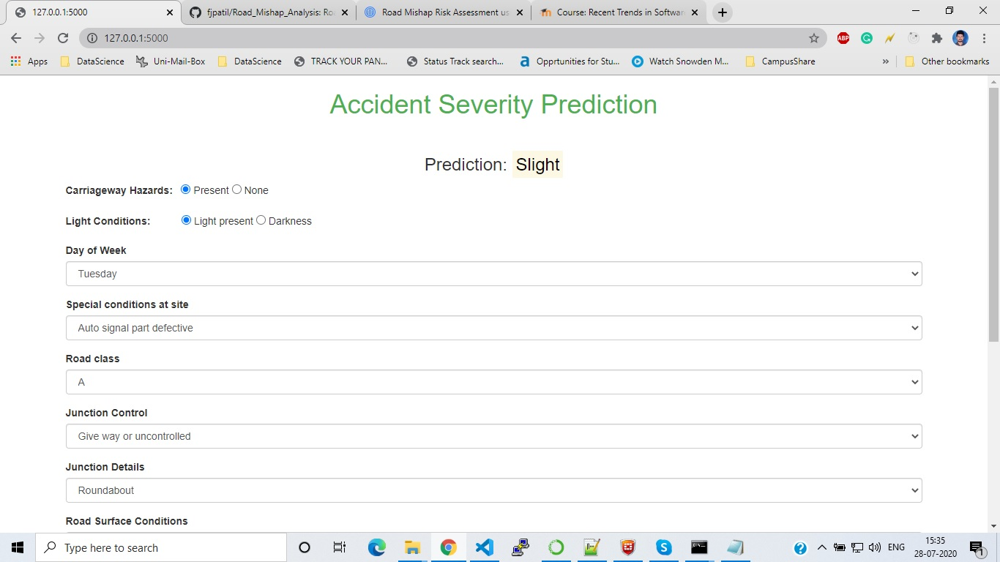
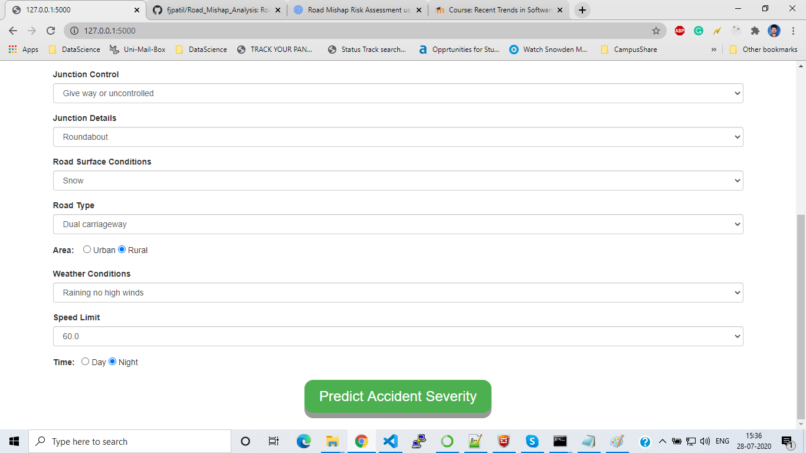

# Road_Mishap_Risk_Assessment_Using_Machine_Learning

# "Recent Trends in Software Engineering(RTiSE)" subject
As a part of RTiSE subject we opted the this project topic and built the machine learning models with different types of algorithms.
The execution and presentation were as follows:

# 1st Assignment: "Find a Topic"
First assignment consists of two major parts: 20 minutes presentation of planned seminar topic and written proposal of the same.

# 2nd Assignment: "Check the Literature"
Second assignment consists of two major parts:
i). 20 minutes presentation of the results of your literature search, including a brief summary of the six most important articles.
ii). Written summary of the results of your literature search, including the specialist search engines we found, how big your field is, 
     the key players/institutions, premier publications/conferences.  And the brief summary of six of the important articles in your field.

# 3nd Assignment: "Let us know how your research is progressing"
Third assignment consists of two major parts:
i). Data Analysis and Feature Engineering code and report
ii). Explanation of the algorithms which are planning to use in the project with written proposal.

# 4th Assignment: "Demonstration of First experimental results"
Fourth assignment consists practicle implementation of algorithms (With code and report).
Any changes expected by Professor should be addressed and present in the final demo.

# 5th Assignment: "Final Demo"
Fifth assignment consists following two major parts:
i). In the final demo we presented the remaining algorithms implementation 
ii). Using flask deployed the model and created Web UI for accident severity prediction based on the selective parameters.

# ABSTRACT
This topic introduces the possibility of road accidents severity based on the provided dataset which creates awareness in the society and give insights to the government about safety precaution need to be taken in accident-prone areas. The proposed prediction model will be built based on different machine learning algorithms on the basis of available data determines the accident severity, most frequent accidents in a particular region based on road conditions, age groups, and so many other factors. Development of Artificial Intelligence technologies pushing personalized analysis and predictions. Several processing techniques as undersampling and oversampling were tried. Our main aim is to predict the serious and fatal severity with high precision and F1 score. Seven different classifiers were tried on this dataset. Random forest classifier worked best for our dataset. The prediction in the UI is based on that model.

# Steps to Run Project(Python 3.8.2 - Execute following steps in project_env path)

1. python -m venv project_env

2. project_env\Scripts\activate.bat

3. python -m venv dependencies

4. pip install -r C:\project_env\requirements.txt

5. Place the Accident_Information.csv file in C:\project_env\github\app\data

6. python C:/project_env/app/main.py

7. Open http://127.0.0.1:5000/ URL in browser and predict the accident severity based on different parameters.

# Technologies used: HTML, CSS and JavaScript and Python Flask

# Note: All the reports and presenations are uploaded here for references.

# Dataset Link : https://www.kaggle.com/tsiaras/uk-road-safety-accidents-and-vehicles

# Web UI Preview:

 
 
